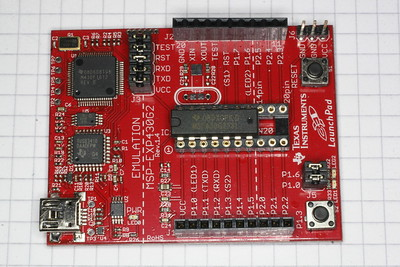

# MSP430Blinky #

A simple MSP430 test program to verify toolchain, programmer and chip.
The hardware is the MSP430 LaunchPad with the MSP430G2231 fitted.

Main loop timing by millisecond timer interrupt generated by Timer A.
500Hz square wave on P1.4, pin 6.

The programs are in C and may be compiled with GCC on Linux.

## Connections ##

| Name   | Port | Pin | Activity |
|:-------|:-----|:----|:---------|
| LED    | P1.0 |  2  | Red LED  |
| SQWAVE | P1.4 |  6  | 500Hz    |

## MSP430 LaunchPad ##

## Building and Programming ##

First of all, we'll need the MSP430 cross-compiler:

`sudo apt install gcc-msp430`

To program the chip, we need 'mspdebug':

`sudo apt install mspdebug`

Finally, to compile and link the code:

`make`

Additional Makefile targets are used to program the chip:

`make prog`

The LED on P1.0 (red) should blink and a 500Hz square wave should appear on P1.4.

